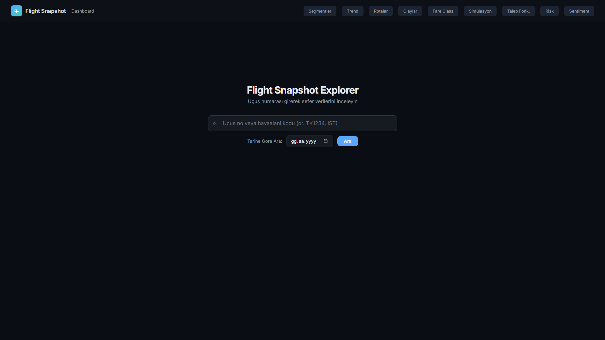
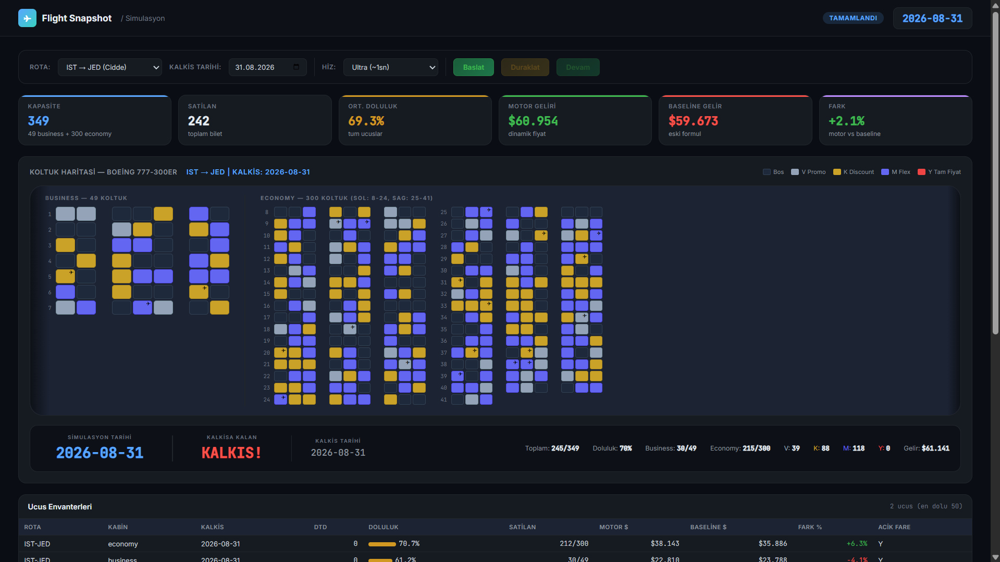
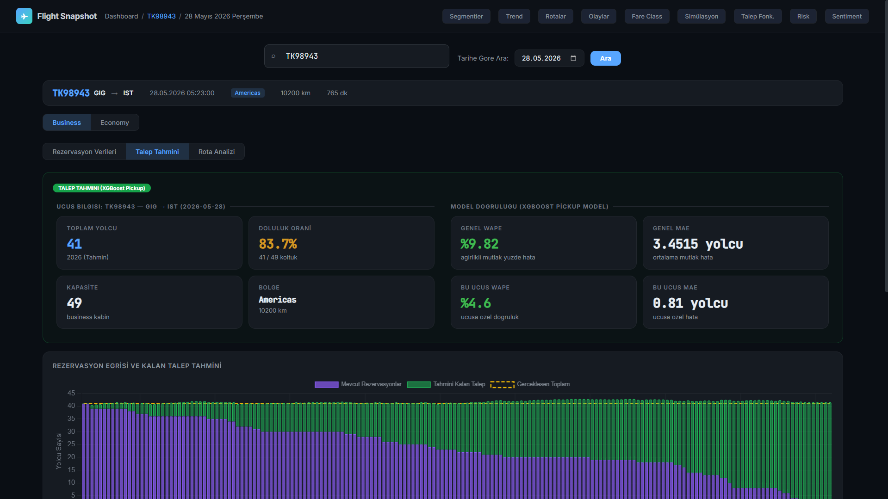
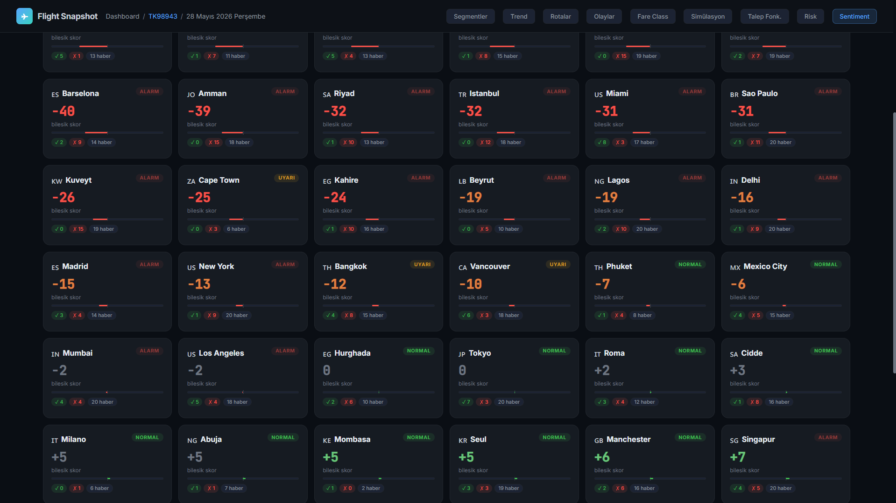

# SeatWise

**End-to-end airline revenue management system** that combines machine learning demand forecasting, dynamic pricing, fare class optimization, and real-time booking simulation.

> Source code is available upon request.

---

## Screenshots

### Dashboard


### Booking Simulation
Real-time seat map with animated bookings, fare class colors, and KPI tracking.



### Demand Forecast
XGBoost Pickup model predictions with SHAP feature importance and model metrics.



### Sentiment Intelligence
Real-time news monitoring for 51 destination cities. DeBERTa NLI classification with GDELT and Google News data.



---

## Architecture

```
                         DASHBOARD (Flask)
                    Simulation · Booking · APIs
                              |
          +-------------------+-------------------+
          |                   |                   |
    SIMULATION          PRICING ENGINE       NETWORK OPTIMIZER
    ENGINE
    Bot agents          base x supply        EMSR-b protection
    Cancel/NoShow       x demand             Bid price control
    Overbooking         x sentiment          O&D fare proration
                        x customer
                              |
                       FORECAST BRIDGE
                              |
          +-------------------+-------------------+
          |                   |                   |
         TFT           Two-Stage XGB        Pickup XGB
    Route-daily         Hurdle model        Remaining pax
    demand forecast     Daily booking       prediction
    MAE: 14.03          AUC: 0.835          MAE: 3.45

                   SENTIMENT INTELLIGENCE
                GDELT + Google News + DeBERTa
                51 cities, 14-day recency
```

## Features

### Demand Forecasting (3 Models)
- **Temporal Fusion Transformer (TFT)** — Route-daily demand prediction with interpretable attention. 200 entities, 30-day horizon, quantile loss. Variable Selection Network provides feature importance for explainability.
- **Two-Stage XGBoost (Hurdle Model)** — Addresses 70.8% zero-inflated daily sales. Classifier (AUC 0.835) + Regressor (MAE 0.78) combined as `P(sale) x E[pax|sale]`.
- **Pickup XGBoost** — Remaining passenger prediction. 49 features, 70.4% improvement over baseline. SHAP TreeExplainer for per-flight explainability.

### Dynamic Pricing
- **4-factor multiplicative formula:** `price = base x supply x demand x sentiment x customer`
- **Data-calibrated coefficients** — Base price via linear regression (R2 = 0.979, n = 102K), load factor curve and route factors from statistical analysis
- **Behavioral pricing** — Session-based customer multiplier using return visits, search patterns, device type, FF tier

### Fare Class Optimization
- **4 fare classes** (V / K / M / Y) with DTD rules, load factor thresholds, and quota limits
- **EMSR-b (Expected Marginal Seat Revenue)** — Forecast-informed protection levels via inverse normal CDF. Dynamically closes discount classes when quotas fill.
- **3-layer decision:** DTD rules → LF thresholds → EMSR-b override

### O&D Network Optimization
- **Bid price control** for connecting vs local passengers (active above 60% LF)
- **Distance-based fare proration** with 15% connecting discount
- **Displacement tracking** — measures revenue saved by rejecting low-yield connecting passengers

### Booking Simulation
- **Real-time simulation** with configurable speed (1x to 14,400x)
- **6 passenger segments** with distinct WTP, booking windows, and no-show rates (3-20%)
- **Overbooking model** — Sell limit at 108% capacity, no-show simulation, denied boarding cost tracking
- **Cancellation model** — Fare-class based daily probabilities (V: 1%, K: 3%, M: 8%, Y: 12%) with refund logic
- **Explainability panel** — TFT attention, pricing decomposition, EMSR-b fare class status

### Sentiment Intelligence
- **51 destination cities** via GDELT API + Google News RSS
- **DeBERTa-v3 NLI** classification (positive / negative / neutral)
- **14-day recency filter** — only fresh news affects pricing
- **Dual impact:** demand volume (+/-30%) and price level (+/-15%)

## Model Performance

| Model | Task | MAE | Key Metric | Training Data |
|-------|------|-----|-----------|---------------|
| TFT | Route-daily demand | 14.03 | Corr: 0.991 | 200 entities x 730 days |
| Pickup XGB | Remaining passengers | 3.45 | WAPE: 9.82% | 49 features, 36.8M rows |
| Two-Stage XGB | Daily bookings | 0.78 | AUC: 0.835 | 31 features, hurdle model |

## Simulation Results (IST-LHR, July, 15 flights)

| Metric | Value |
|--------|-------|
| Revenue Delta vs Baseline | +2.8% |
| Average Load Factor | 69.9% |
| Fare Mix V / K / M / Y | 16.5% / 36.7% / 48.7% / 0.3% |
| Cancellations | 72 |
| No-Shows | 125 |
| Denied Boardings | 0 |

## Tech Stack

| Layer | Technology |
|-------|-----------|
| Backend | Python, Flask |
| Database | DuckDB, Apache Parquet |
| Forecasting | PyTorch, pytorch-forecasting (TFT) |
| ML | XGBoost, scikit-learn, SHAP |
| NLP | HuggingFace Transformers, DeBERTa-v3 |
| Optimization | SciPy (EMSR-b inverse normal CDF) |
| Frontend | Vanilla JS, Chart.js |
| Data | GDELT API, Google News RSS |

## Data

The system is built on a synthetic airline dataset modeled after the IST hub network:
- **50 routes**, 51 destinations across 5 regions
- **2 cabin classes** (Economy ~300 seats, Business ~49 seats)
- **~146,000 daily observations** across 200 route-cabin entities over 2 years
- Panel data structure enables cross-sectional learning across routes
