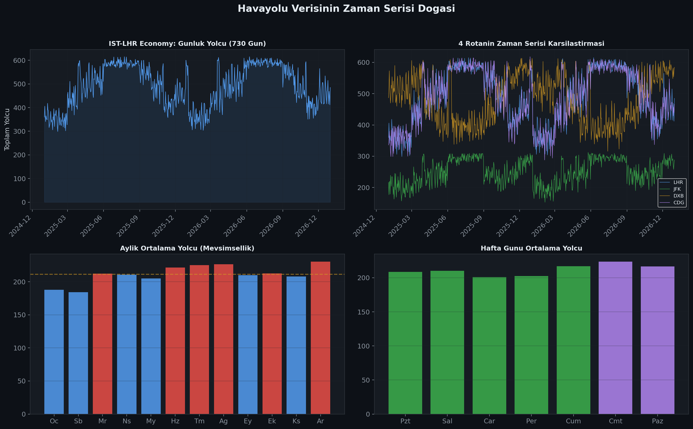
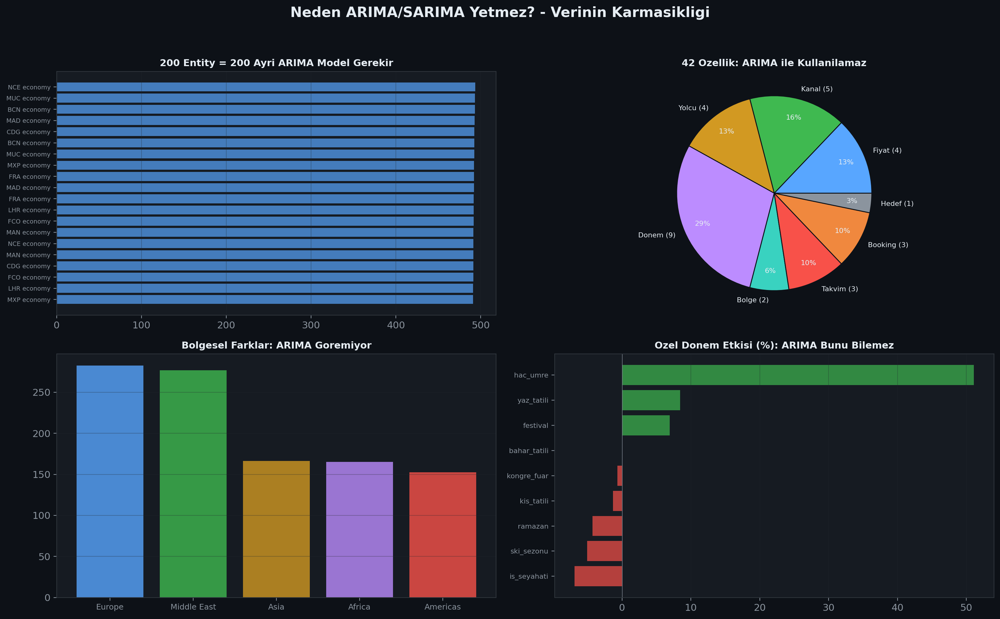
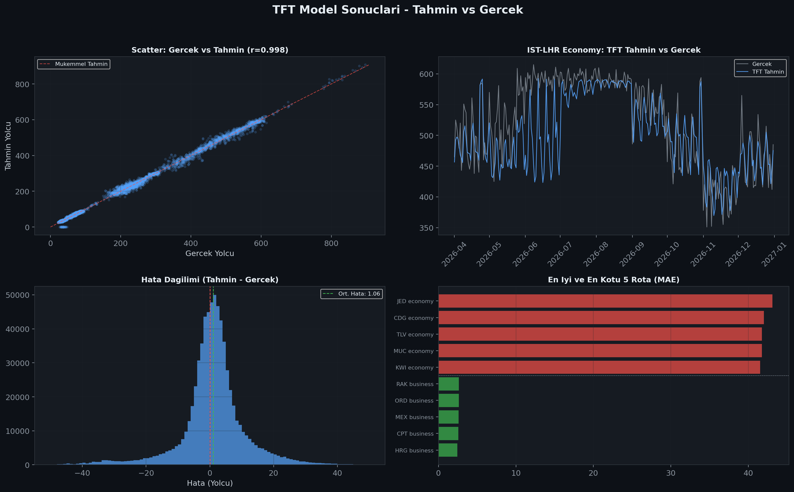
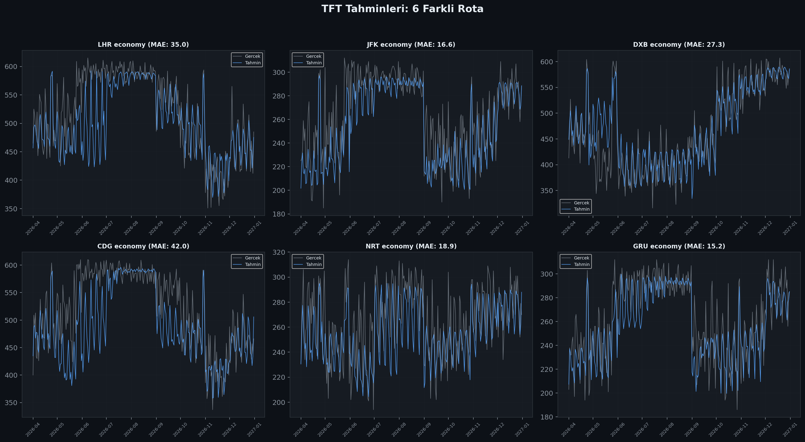
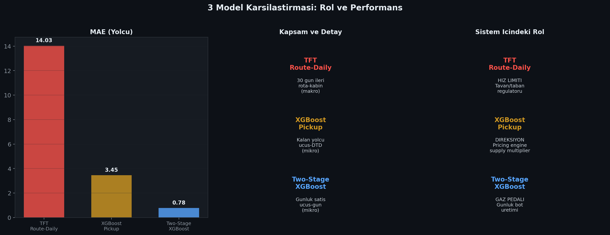
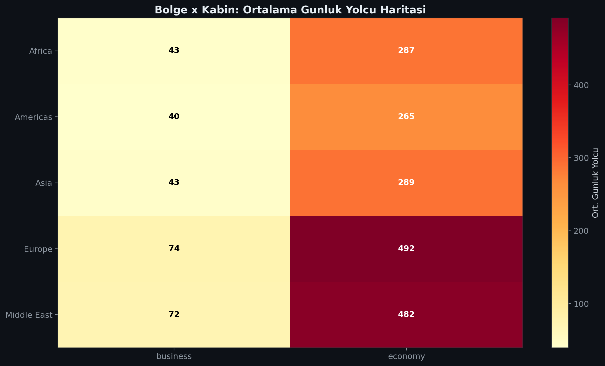

# SeatWise: Time Series Analizi ve Temporal Fusion Transformer

## Veri Yapisindan Talep Tahminine: Kapsamli Teknik Dokuman

---

# 1. BU DOKUMAN NEYI KAPSAR?

SeatWise projesi uctan uca 5 asamadan olusur:

```
A. VERI           B. TAHMIN MODELLERI     C. FIYATLAMA     D. SIMULASYON     E. DASHBOARD
(ham veri,        (TFT, XGBoost,          (4 carpan,       (bot yolcular,    (UI, API,
 pipeline,         time series,            fare class,      overbooking)      sentiment)
 feature eng.)     pickup, demand)         EMSR-b)
```

**Bu dokuman A ve B asamalarina odaklanir:**
- Veri yapisi ve hazirlama sureci
- Time series kavraminin projede ne ifade ettigi
- Neden klasik ARIMA/SARIMA modelleri kullanilamayacagi
- Temporal Fusion Transformer (TFT) modelinin detayli incelemesi
- XGBoost modellerinin destekleyici rolu
- Gercek veriden uretilmis HD grafiklerle pekistirme


---

# 2. VERI YAPISI

## 2.1 Ham Verinin Boyutu

SeatWise, Istanbul hub'i (IST) uzerinden 51 destinasyona, 100 rotaya, 2 kabin sinifina ait 2 yillik (2025-2026) veri ile calisir.

| Veri Dosyasi | Boyut | Satir | Aciklama |
|---|---|---|---|
| flight_snapshot_v2.parquet | 205 MB | ~37M | Her ucus-gun icin anlik goruntu |
| bookings_enriched.parquet | 341 MB | ~M | Rezervasyon detaylari |
| tft_route_daily.parquet | 7.1 MB | 138,018 | Rota-kabin-gun toplami (TFT icin) |
| pickup_master.parquet | ~200 MB | 36.8M | Pickup XGBoost icin |
| demand_training.parquet | 107 MB | 36.9M | Two-Stage XGBoost icin |

## 2.2 Neden Rota-Gunluk Toplama?

Ham veri ucus bazlidir: her ucus numarasi (TK1234) icin her gun bir kayit vardir. Ancak zaman serisi analizi icin bu format uygun degildir:

```
HAM VERI (ucus bazli):                    TFT VERISI (rota-gunluk):
+--------+--------+------+-----+         +------------------+--------+-----+
| TK1234 | 2026-07-15 | eco | 285 |      | IST_LHR_economy  | 2026-07-15 | 612 |
| TK1236 | 2026-07-15 | eco | 327 |  --> | IST_LHR_business | 2026-07-15 | 89  |
| TK1234 | 2026-07-15 | biz |  89 |      | IST_JFK_economy  | 2026-07-15 | 445 |
| TK5678 | 2026-07-15 | eco | 445 |      | ...              |            |     |
+--------+--------+------+-----+         +------------------+--------+-----+

  Ayni gunde ayni rotada birden fazla ucus      Her rota-kabin-gun icin tek sayi
  olabilir. Bunlar toplanir.                    = 200 entity x 730 gun = 146K satir
```

Bu toplama islemi `build_tft_route_daily.py` scriptinde yapilir.

## 2.3 Entity Kavrami

TFT modeli "entity" (varlik) bazli calisir. Her entity bir zaman serisidir:

```
entity_id = "{rota}_{kabin}"

Ornekler:
  IST_LHR_economy   = Istanbul-London Economy sinifi
  IST_JFK_business   = Istanbul-New York Business sinifi
  DXB_IST_economy    = Dubai-Istanbul Economy sinifi

Toplam: 200 entity (100 rota x 2 kabin)
Her entity: 730 gun (2025-01-01 - 2026-12-31)
```

## 2.4 42 Sutunluk Feature Seti

TFT route-daily verisinde 42 sutun vardir. Bunlar 5 kategoriye ayrilir:

**Sabit Ozellikler (rota boyunca degismez):**
| Ozellik | Tip | Aciklama |
|---|---|---|
| entity_id | Kategorik | Rota-kabin kimligi |
| route | Kategorik | IST-LHR gibi |
| cabin_class | Kategorik | economy / business |
| region | Kategorik | Europe, Asia, Middle East, Americas, Africa |
| direction | Kategorik | outbound / inbound |
| distance_km | Sayisal | Rota mesafesi (km) |
| flight_time_min | Sayisal | Ucus suresi (dakika) |

**Bilinen Gelecek (takvim + ozel donemler -- gelecekte de bilinir):**
| Ozellik | Aciklama |
|---|---|
| dep_year, dep_month, dep_dow | Kalkis yili, ayi, haftanin gunu |
| n_flights | O gunku ucus sayisi |
| is_special_period | Ozel donem mi? (boolean) |
| special_period | Hangi donem? (bayram, yilbasi vs.) |
| tag_yaz_tatili ... tag_hac_umre | 9 ozel donem etiketi (boolean) |

**Bilinmeyen Gecmis (sadece gecmiste gozlenir):**
| Ozellik | Aciklama |
|---|---|
| total_pax | **HEDEF**: O gun toplam yolcu sayisi |
| avg_fare, std_fare, min_fare, max_fare | Fiyat istatistikleri |
| n_bookings | Rezervasyon sayisi |
| avg_group_size | Ortalama grup buyuklugu |
| corporate_pct, agency_pct, website_pct, mobile_pct | Kanal dagilimi |
| connecting_pct | Baglantili yolcu orani |
| early_booking_pct, late_booking_pct | Erken/gec rezervasyon orani |
| child_pct, gold_elite_pct, elite_pct, halal_pct | Yolcu profili |

Bu ayrim TFT icin kritiktir: model gelecekte hangi bilgilerin erisilebilir oldugunu bilir.

---

# 3. TIME SERIES NEDIR VE PROJEDE NE IFADE EDER?

## 3.1 Temel Kavram

Zaman serisi (time series), zamana gore siralanmis olcumlerin dizisidir. Havayolu verisinde:

```
t = gun (2025-01-01, 2025-01-02, ..., 2026-12-31)
y(t) = o gun o rotadaki toplam yolcu sayisi

IST_LHR_economy zaman serisi:
  t:   1    2    3    4    5    6    7    8    ...  730
  y: 412  398  445  389  401  367  312  425   ...  478
```

## 3.2 Havayolu Verisinin 4 Temel Zaman Serisi Ozelligi



### (a) Mevsimsellik (Seasonality)
Yaz aylari (Haziran-Agustos) yuksek, kis aylari (Ocak-Subat) dusuk talep. Ancak bu basit bir sinuzoidal degil -- bolgeye gore degisir:

```
Europe:      Yaz yuksek (tatil)    | Kis dusuk
Middle East: Kis yuksek (havadan kacar) | Yaz dusuk (45 derece)
Asia:        Nispeten duz            | Yilbasi + CNY tepe
```

### (b) Haftalik Donemsellik (Weekly Cycle)
Hafta ici is seyahati (Pzt-Cum), hafta sonu leisure azalmasi. Bu donemsellik rota tipine gore degisir:
- Is rotalari (LHR, FRA): Hafta ici belirgin yuksek
- Tatil rotalari (HKT, HRG): Hafta sonu yuksek

### (c) Ozel Olay Etkileri (Event-Driven Spikes)
Bayram, yilbasi, ski sezonu, kongre donemi gibi olaylar ani talep dalgalanmalari yaratir. Bunlar periyodik degildir -- her yil farkli tarihlere duserler (ozellikle dini bayramlar).

### (d) Cross-Entity Korelasyonlar
IST-LHR yuksekken IST-CDG da yuksektir (ayni bolge). IST-DXB tam tersi mevsimsellik gosterir. ARIMA bunu goremez cunku her seriyi bagimsiz modeller.

## 3.3 Time Series Projenin Neresinde?

```
PROJE AKISI:

  [VERI] -----> [TIME SERIES TAHMIN] -----> [FIYATLAMA] -----> [UYGULAMA]
                      |
                      |--- TFT: "Bu rotada 30 gun icerisinde
                      |         gun gun kac yolcu bekleniyor?"
                      |         (MAKRO TAHMIN -- buyuk resim)
                      |
                      |--- XGBoost Pickup: "Su an bu ucusa
                      |         kac kisi daha gelecek?"
                      |         (MIKRO TAHMIN -- anlik karar)
                      |
                      |--- Two-Stage XGBoost: "Bugun bu ucusta
                                kac satis olacak?"
                                (OPERASYONEL -- gunluk motor)

  TFT olmadan sistem "kor" olur -- sadece mevcut duruma tepki verir,
  geleceği goremez. TFT bir "radar" gibidir: 30 gun sonrasini gorur.
```

---

# 4. NEDEN ARIMA / SARIMA KULLANILAMAZ?



## 4.1 Sorun 1: 200 Ayri Model Gerekir

ARIMA tek bir zaman serisini modeller. SeatWise da 200 entity (rota-kabin) vardir. Bu demektir ki:

```
ARIMA yaklasimi:
  200 ayri model egit
  200 ayri hiperparametre ara (p, d, q, P, D, Q, m)
  200 ayri model izle, guncelle, yeniden egit
  200 ayri modelin hatalarini takip et

  Toplam is yuku: YONETILMEZ

TFT yaklasimi:
  1 model egit (200 entity tek modelde)
  Ortak oruntuler otomatik ogrenilir
  Yeni rota eklenince sadece veri ekle, yeniden egit
```

## 4.2 Sorun 2: Eksojen Degiskenler (42 ozellik)

ARIMA/SARIMA temel olarak tek degiskenli (univariate) modellerdir. SARIMAX ile eksojen degisken eklenebilir ama pratikte 3-5 degiskeni gecmek zorlasir.

SeatWise TFT modelinde **42 ozellik** vardir -- bunlarin 18 tanesi surekli degisen bilinmeyen degiskenlerdir. ARIMA ile bu mumkun degildir:

```
ARIMA: y(t) = f(y(t-1), y(t-2), ..., hata(t-1), hata(t-2), ...)
  + belki 2-3 eksojen degisken

TFT:   y(t) = f(
    gecmis 60 gun: [y, fare, bookings, channels, profiles] x 18 degisken
    gelecek 30 gun: [takvim, bayram, etkinlik] x 15 degisken
    sabit: [rota, bolge, mesafe, kabin] x 7 degisken
    entity: [200 farkli rota-kabin, her birinin kendine ozgu pattern'i]
  )
```

## 4.3 Sorun 3: Degisen Mevsimsellik

SARIMA sabit periyotlu mevsimsellik varsayar (m=7 haftalik, m=365 yillik). Ancak havayolu verisinde:

- Ramazan her yil 11 gun kayar (Hicri takvim)
- Bayramlar yildan yila farkli tarihlere duser
- Ski sezonu hava durumuna gore 2-3 hafta kayabilir
- Kongre/fuar donemleri duzensizdir

```
SARIMA: "Her 365 gunde bir ayni pattern tekrarlar"
         YANLIS -- bayram 2025 te Nisan da, 2026 da Mart ta

TFT:    tag_bayram=1 oldugunda talep artar, tarih farketmez
        DOGRU -- olay bazli, tarih bazli degil
```

## 4.4 Sorun 4: Cross-Entity Bilgi Paylasimi

ARIMA her seriyi bagimsiz modeller. Ama havayolu aginda rotalar birbirine baglidir:

```
IST-LHR yuksek talep goruyorsa:
  IST-CDG de muhtemelen yuksektir (ayni bolge, ayni mevsim)
  IST-MAN de etkilenir (ayni ulke)
  IST-DXB ETKILENMEYEBiLiR (farkli bolge, farkli mevsimsellik)

ARIMA bunu bilmez. TFT "region" ve "direction" bilgisiyle
otomatik olarak bolgesel oruntuler ogrenir.
```

## 4.5 Sorun 5: Olasiliksal Cikti

ARIMA nokta tahmini verir. TFT quantile tahminleri uretir:

```
ARIMA: "15 Temmuz IST-LHR: 285 yolcu"
  Peki ne kadar emin? Bilinmiyor.

TFT:   "15 Temmuz IST-LHR:
         %10 olasilik: 240 (en az)
         %25 olasilik: 258
         %50 olasilik: 285 (median)
         %75 olasilik: 308
         %90 olasilik: 320 (en fazla)"

  Bu guven araligi fiyatlama icin kritiktir:
  Dar aralik = emin = agresif fiyatla
  Genis aralik = belirsiz = ihtiyatli fiyatla
```

## 4.6 Ozet Karsilastirma

| Ozellik | ARIMA/SARIMA | TFT |
|---|---|---|
| Coklu zaman serisi | Her biri ayri model | Tek model, 200 entity |
| Eksojen degisken | Max 3-5 | 42 (5 farkli tipte) |
| Mevsimsellik | Sabit periyot | Olay bazli, esnek |
| Cross-entity | Yok | Bolge/kabin bazli ogrenme |
| Olasiliksal cikti | Yok (ekstra lazim) | 5 quantile yerlesik |
| Yorumlanabilirlik | Katsayilar | Attention + feature importance |
| Olceklenebilirlik | Kotu (N model) | Iyi (1 model) |
| Uzun vadeli bagimlilik | Zayif | Guclu (LSTM + Attention) |

---

# 5. TEMPORAL FUSION TRANSFORMER (TFT)

## 5.1 TFT Nedir?

Temporal Fusion Transformer, 2019 yilinda Google tarafindan gelistirilen, cok degiskenli zaman serisi tahmini icin tasarlanmis bir deep learning modelidir. Ozellikle su durumlarda gucludur:

- Birden fazla iliskili zaman serisi (multi-entity)
- Hem bilinen hem bilinmeyen gelecek degiskenleri
- Farkli tipte ozellikler (sabit, zaman-degisen, kategorik, sayisal)
- Hem tahmin hem yorumlama ihtiyaci

## 5.2 Mimari Bilesenleri

```
TFT MIMARISI - 6 KATMAN:

+------------------------------------------------------------------+
|                                                                  |
|  1. VARIABLE SELECTION NETWORK                                   |
|     Her ozelligin onemini otomatik olarak ogrenir.               |
|     "avg_fare fiyatlandirmada onemli, halal_pct degil"          |
|     -> Gereksiz ozellikleri otomatik susturur                    |
|                                                                  |
|  2. GATED RESIDUAL NETWORK (GRN)                                |
|     Her katmanda bilgi akisini kontrol eder.                     |
|     "Bu bilgi gerekli mi?" sorusuna cevap verir.                |
|     -> Vanishing gradient problemini onler                       |
|                                                                  |
|  3. STATIC COVARIATE ENCODERS                                   |
|     Sabit ozellikleri (bolge, mesafe) encode eder ve             |
|     diger katmanlara context olarak besler.                      |
|     "Bu LHR rotasi, uzun mesafe, Avrupa" -> tum katmanlara      |
|                                                                  |
|  4. SEQUENCE-TO-SEQUENCE LAYER (LSTM)                           |
|     Encoder: Gecmis 60 gunu isler                                |
|     Decoder: Gelecek 30 gunu olusturur                           |
|     "Son 60 gundeki trendi analiz et, 30 gun ileri tahmin et"   |
|                                                                  |
|  5. MULTI-HEAD ATTENTION                                         |
|     Gecmisin hangi gunlerinin gelecek icin onemli                |
|     oldugunu ogrenir. 4 attention head.                          |
|     "30 gun onceki bayram etkisi bugun da etkili"               |
|                                                                  |
|  6. QUANTILE OUTPUT                                              |
|     5 quantile (p10, p25, p50, p75, p90) uretir.                |
|     "Tahmin 285, ama %90 olasilikla 240-320 arasi"              |
|                                                                  |
+------------------------------------------------------------------+
```

## 5.3 SeatWise Icin TFT Konfigurasyonu

```python
# kaggle_tft_route.py dosyasindan:

training = TimeSeriesDataSet(
    df[df.time_idx <= VAL_END],
    time_idx="time_idx",
    target="total_pax",
    group_ids=["entity_id"],
    max_encoder_length=60,       # Gecmis 60 gun
    max_prediction_length=30,    # Gelecek 30 gun
    min_encoder_length=30,       # Minimum 30 gun gecmis
    min_prediction_length=1,     # Minimum 1 gun tahmin

    # Sabit kategorik ozellikler
    static_categoricals=["entity_id", "route", "cabin_class", "region", "direction"],

    # Sabit sayisal ozellikler
    static_reals=["distance_km", "flight_time_min"],

    # Bilinen gelecek kategorik
    time_varying_known_categoricals=[
        "dep_month", "dep_dow", "dep_year", "n_flights",
        "is_special_period", "special_period",
        "tag_yaz_tatili", "tag_kis_tatili", "tag_bahar_tatili",
        "tag_ramazan", "tag_kongre_fuar", "tag_ski_sezonu",
        "tag_festival", "tag_is_seyahati", "tag_hac_umre"
    ],

    # Bilinen gelecek sayisal
    time_varying_known_reals=["time_idx"],

    # Bilinmeyen gecmis sayisal (SADECE encoder'da kullanilir)
    time_varying_unknown_reals=[
        "total_pax", "avg_fare", "std_fare", "max_fare", "min_fare",
        "n_bookings", "avg_group_size",
        "corporate_pct", "agency_pct", "website_pct", "mobile_pct",
        "connecting_pct", "early_booking_pct", "late_booking_pct",
        "child_pct", "gold_elite_pct", "elite_pct", "halal_pct"
    ],

    # Her entity icin ayri normalizasyon
    target_normalizer=GroupNormalizer(
        groups=["entity_id"],
        transformation="softplus"
    ),
)

tft = TemporalFusionTransformer.from_dataset(
    training,
    learning_rate=1e-3,
    hidden_size=64,
    attention_head_size=4,
    dropout=0.1,
    hidden_continuous_size=32,
    loss=QuantileLoss(quantiles=[0.1, 0.25, 0.5, 0.75, 0.9]),
    optimizer="adam",
    reduce_on_plateau_patience=5,
)
```

### Neden Bu Parametreler?

| Parametre | Deger | Neden? |
|---|---|---|
| max_encoder_length=60 | 60 gun gecmis | 2 aylik trend + mevsimsellik yakalamak icin |
| max_prediction_length=30 | 30 gun ileri | Havayolu planlamasi icin ideal ufuk |
| hidden_size=64 | 64 noron | 200 entity icin yeterli kapasite, overfitting riski dusuk |
| attention_head_size=4 | 4 head | Farkli zaman dilimlerine paralel dikkat |
| dropout=0.1 | %10 | Regularizasyon -- overfitting onleme |
| quantiles=[0.1,0.25,0.5,0.75,0.9] | 5 quantile | Fiyatlama icin guven araligi |
| GroupNormalizer | Entity bazli | IST-LHR (300+ pax) ile IST-ABV (30 pax) ayni olcekte |

## 5.4 Egitim Sureci

```
EGITIM:
  Veri:     tft_route_daily.parquet (138K satir)
  Train:    2025-01-01 -> 2025-12-31 (time_idx 0-364)
  Val:      2025-10-01 -> 2026-03-31 (time_idx 274-454)
  Test:     2026-04-01 -> 2026-12-31 (time_idx 455+)

  Platform: Kaggle GPU (T4/P100)
  Epoch:    Max 50, EarlyStopping patience=8
  Batch:    128
  Optimizer: Adam, LR=1e-3, ReduceOnPlateau patience=5

CIKTILAR:
  tft_full_checkpoint.ckpt       Tam model checkpoint
  tft_training_dataset.pt        Egitim seti (yeni veri icin)
  tft_route_daily_model.pt       State dict (hafif)
  tft_predictions.parquet        Flat tahminler (691K satir)
  tft_predictions_indexed.parquet Indeksli + quantile (55K satir)
  tft_feature_importance.json    Ozellik onemleri
```

## 5.5 Model Sonuclari



### Genel Metrikler

| Metrik | Deger | Aciklama |
|---|---|---|
| MAE | 14.03 yolcu | Rota-gun bazinda ortalama hata |
| MAPE | 5.9% | Her 100 yolcudan 6 sinda yanilir |
| Korelasyon | 0.991 | Neredeyse mukemmel lineer iliski |
| Flat MAE | 6.87 | Horizon-weighted averaging oncesi |

### Rota Bazli Performans



Model bazi rotalarda daha iyi, bazlarinda daha zayiftir:
- **En iyi**: Yuksek hacimli, duzgun seyreden rotalar (LHR, CDG)
- **En zor**: Dusuk hacimli, volatil rotalar (ABV, MBA)

---

# 6. XGBOOST MODELLERI: TFT NIN DESTEKLEYICILERI

TFT makro talebi tahmin ederken, XGBoost modelleri mikro (ucus bazli) tahminler yapar.

## 6.1 XGBoost Pickup (Kalan Yolcu Tahmini)

```
Soru: "Su an 180 koltuk satilmis. Kalkisa 30 gun var. Kac kisi daha gelecek?"
Cevap: "remaining_pax = 105 (+-3.45 hata ile)"

Girdi: 49 ozellik
  - dtd, pax_sold_cum, pax_last_7d, capacity, remaining_seats, load_factor
  - distance_km, flight_time_min, dep_month, dep_dow, dep_hour
  - 13 ozel donem etiketi
  - 16 rota seviyesi istatistik
  - 8 one-hot encoding (kabin + bolge)

Model: XGBoost Regressor
  - 500 agac, max_depth=7, learning_rate=0.05
  - Train: 2025 (18.4M satir), Test: 2026 (18.4M satir)

Sonuc:
  MAE:  3.45 yolcu
  RMSE: 6.02 yolcu
  MAPE: 9.82%
  Baseline (model yok): MAE 11.65
  Iyilestirme: %70.4
```

## 6.2 Two-Stage XGBoost (Gunluk Talep)

```
Soru: "Bugun bu ucusa kac kisi bilet alacak?"
Cevap: "p_sale=0.75, e_pax=1.6 -> 1.2 yolcu"

Asama 1: XGBClassifier -> "Bugun satis olacak mi?"
  n_estimators=400, max_depth=6, learning_rate=0.08

Asama 2: XGBRegressor -> "Kac kisi?"
  n_estimators=600, max_depth=7, learning_rate=0.06

Nihai tahmin = p_sale x max(e_pax, 0)

Sonuc:
  MAE:  0.78 yolcu/gun
  AUC:  0.835
  31 feature
```

## 6.3 Uc Modelin Birlikte Calismasi



```
FORECAST BRIDGE -- MODELLERIN ORKESTRASYON NOKTASI:

  Her simulasyon gunu icin:

  1. Two-Stage -> daily_demand = 1.2 yolcu (GAZ PEDALI)
     "Bugun bu kadar yolcu bekleniyor"

  2. TFT -> tft_total = 280 yolcu (HIZ LIMITI)
     S-curve: DTD=30 iken kumulatif %93 satilmis olmali
     tavan = 280 x 0.93 x 2.0 = 521
     taban = 280 x 0.93 x 0.3 = 78
     Gercek satis (180) taban ve tavan arasinda mi? -> EVET, normal

     Eger gercek satis > tavan: Two-Stage ciktisini %30'a dusur (FREN)
     Eger gercek satis < taban: Two-Stage ciktisini %150'ye cikar (HIZLAN)

  3. Pickup -> remaining = 105 yolcu (DIREKSIYON)
     expected_final_lf = (180 + 105) / 300 = %95
     -> Pricing engine'e: "Bu ucus dolacak, fiyati artir!"
```

---

# 7. BOLGE-KABIN ANALIZI



Bu isitma haritasi TFT modelinin neden entity bazli normalizasyona ihtiyac duydigini gosterir. Avrupa economy ile Ortadogu business arasinda 5-10 katlik fark vardir.

---

# 8. DENENEN VE BASARISIZ OLAN YAKLASIMLAR

## 8.1 TFT Flight-Level (Basarisiz)

Ilk deneme ucus bazli TFT idi:
- Her ucus numarasi bir entity
- entity sayisi: 10,000+ (cok fazla)
- Veri: tft_dataset.parquet (22 MB, stratified sampled)
- Sonuc: Entity boyutu modeli bogdu, egitim yakinlasmadi

**Ders:** Rota-gunluk toplama ile entity sayisini 200'e dusurduk.

## 8.2 Enhanced XGBoost (Basarisiz)

TFT route-daily tahminlerini XGBoost'a ek feature olarak ekleme denemesi:
- route_demand (TFT ciktisi) + rota istatistikleri + kanal bilgisi
- 43 feature
- Sonuc: MAE 0.855 > baseline 0.780

**Ders:** Fazla feature ekleme her zaman iyilestirme getirmez. TFT ve XGBoost farkli granularitede calisir; birlestirmek yerine Forecast Bridge ile orkestre etmek daha etkili.

---

# 9. TEKNIK DETAYLAR

## 9.1 GroupNormalizer

TFT'nin en onemli tasarim karari: her entity icin ayri normalizasyon.

```
IST_LHR_economy: ortalama 450 yolcu/gun -> normalize edilmis [0, 1]
IST_ABV_economy: ortalama 35 yolcu/gun  -> normalize edilmis [0, 1]

GroupNormalizer(groups=["entity_id"], transformation="softplus")

softplus: log(1 + exp(x)) -- negatif olmayan, yumusak donusum
Her entity kendi olceginde modellenir, sonra geri donusturulur.
```

## 9.2 NaNLabelEncoder

Kategorik degiskenler icin NaN-safe encoding:
```
Her kategorik degisken icin NaNLabelEncoder(add_nan=True) kullanilir.
Yeni/bilinmeyen kategoriler NaN olarak encode edilir, model craslenmez.
```

## 9.3 Horizon-Weighted Averaging

TFT 30 gun ileri tahmin uretir. Ayni gun icin birden fazla horizon'dan tahmin gelebilir:

```
15 Temmuz icin:
  horizon=1 tahmini: 285 (1 gun once yapilmis, en guvenilir)
  horizon=5 tahmini: 280 (5 gun once yapilmis)
  horizon=15 tahmini: 275 (15 gun once yapilmis)
  horizon=30 tahmini: 270 (30 gun once yapilmis, en az guvenilir)

Agirlikli ortalama: w = 1/horizon
  final = (285/1 + 280/5 + 275/15 + 270/30) / (1 + 1/5 + 1/15 + 1/30)
  final ~ 284 (kisa vadeli tahminlere daha cok agirlik)
```

## 9.4 QuantileLoss

```python
loss = QuantileLoss(quantiles=[0.1, 0.25, 0.5, 0.75, 0.9])

Bu 5 quantile ile model sadece nokta tahmini degil,
talebin olasilik dagılimini da ogenir:

  p10 = "En az bu kadar yolcu gelir (%90 olasilikla)"
  p25 = "Alt ceyrek"
  p50 = "Median tahmin"
  p75 = "Ust ceyrek"
  p90 = "En fazla bu kadar yolcu gelir (%90 olasilikla)"

Fiyatlama icin:
  Dar band (p10 ~ p90) = Emin tahmin -> Agresif fiyatlama
  Genis band = Belirsiz -> Ihtiyatli fiyatlama
```

---

# 10. SONUC

SeatWise projesinde time series analizi sistemin "radari" gorevini gorur. TFT modeli:

1. **200 rota-kabin kombinasyonunu tek modelde** ogrenir
2. **42 farkli ozellik** kullanir (ARIMA max 3-5)
3. **Olay bazli mevsimsellik** yakalar (ARIMA sabit periyot varsayar)
4. **Quantile tahminler** ile belirsizligi olcer
5. **Cross-entity bilgi paylasimi** yaparak bolgesel oruntuler ogrenir
6. **%5.9 MAPE** ile havayolu endustrisinde kabul edilebilir seviyede tahmin uretir

XGBoost modelleri bu makro tahminleri mikro (ucus bazli) kararlara cevirir. Uc modelin Forecast Bridge uzerinden orkestre edilmesi, tek basina hicbir modelin basaramayacagi bir hassasiyeti saglar.

```
ARIMA/SARIMA:  Tek degisken, tek entity, sabit mevsimsellik
               -> Havayolu gelir yonetimi icin YETERSIZ

TFT:           42 degisken, 200 entity, esnek mevsimsellik,
               olasiliksal cikti, attention-based yorumlama
               -> Bu problem icin DOGRU ARAC
```

---

*Bu dokuman SeatWise projesinin 2026-03-29 tarihindeki durumunu yansitmaktadir.*
*Tum grafikler projenin gercek verisinden uretilmistir.*
*Hazirlayan: Ahmet Furkan Gokbulut*
